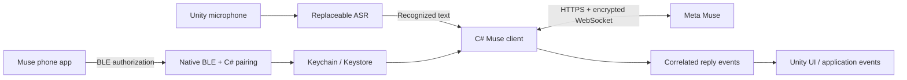

# Architecture and API

## Components

- `MusePairingProtocol`, `MusePairingController`, `MuseBlePairing`: pairing v5 cryptography, bounded state machine, native peripheral lifecycle.
- `MuseMacPeripheral`: C ABI adapter for CoreBluetooth/Keychain. Android uses JNI with `io.github.openxiaoshan.muse` classes.
- `MuseDeviceStore`: encrypted platform storage. Unsupported platforms cannot silently claim successful persistence.
- `MuseAccount`: HTTPS device authentication, VM discovery and refresh. The default VM is selected; there is no VM picker yet.
- `MuseNoiseConnection`, `MuseWire`: Noise XX, encrypted frames, fragmentation and independent request streams.
- `MuseClient`: chat submission and event subscription. Open the subscription first for the **existing default main conversation**. A new side-chat ID cannot be subscribed before it has been created.
- `MuseReplyCollector`: accepts the acknowledged message ID or its canonical parent; associates subsequent deltas by message ID and excludes unrelated App activity.
- `MuseVoiceButton`: recording/state lifecycle and asynchronous service calls; marshals reply UI changes onto Unity Update.
- `MuseObjectView`: optional sample canvas. `MuseObjectFont` lets the host supply a language-appropriate font.

## Integration points

`MuseVoiceButton` exposes `OnTranscript`, `OnReply`, `Changed`, `State`, `Status`, `Press()`, `StopRecordingAndSend()`, `Cancel()` and `Disconnect()`.

`Transcribe` has type `Func<byte[], string, CancellationToken, Task<string>>`. WAV data is cleared when processing ends. Do not retain it unless your application explicitly needs to.

`ClientFactory` allows custom `IMuseChatClient` implementations and isolated tests. `Configure(credentials, asrKey, persist: true)` persists explicitly provided configuration on supported platforms. Runtime secret fields are not Unity-serialized.

The low-level client returns `MuseChatAcknowledgement` with `MessageId` and `ParentMessageId`. `SubscribeAsync` accepts an `onReady` callback that fires only after a successful subscription response. The subscription Task remains active until canceled or failed. Observe/cancel this Task when ending an exchange.

## Runtime requirements

Android host builds need INTERNET, RECORD_AUDIO and BLE permissions. The Editor Gradle callback merges these into the generated manifest without replacing the host application manifest, and adds JNI keep rules. Peripheral advertising/GATT server support is required. Runtime permission prompts remain explicit.

macOS hosts need `NSBluetoothAlwaysUsageDescription` and `NSMicrophoneUsageDescription` in their application Info.plist. The checked-in plugin contains arm64 and x86_64 slices. Rebuild it from `Native~/macOS` when changing native source, and restart an Editor that already loaded the old binary.

Credentials use a package-specific store. Multiple applications should review their desired macOS Keychain isolation and provision their own store identifier when appropriate. The sample's main-chat access is scoped by the Muse account authorization.
